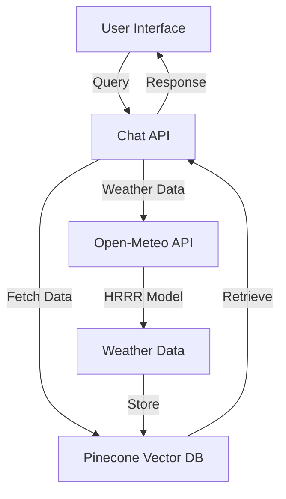
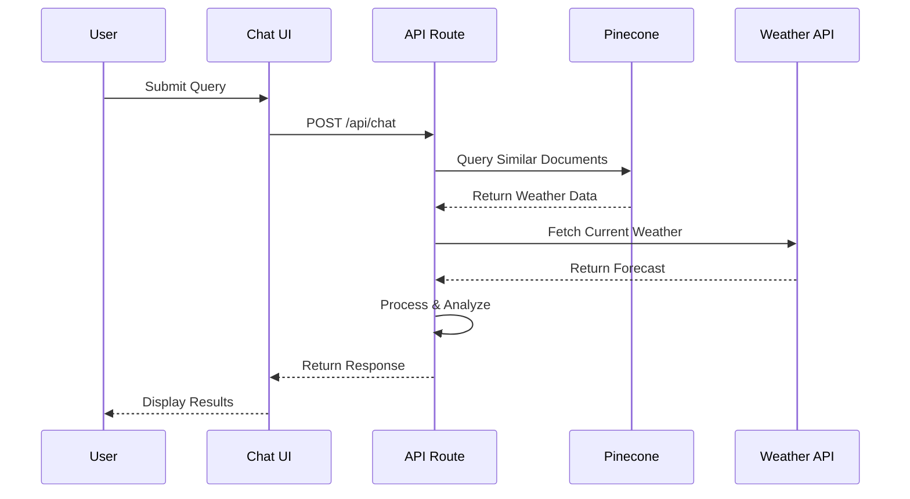

# Paragliding AI Assistant 🪂

A sophisticated AI-powered weather assistant for paragliding enthusiasts, providing real-time weather conditions and flying recommendations for popular paragliding locations in the Bay Area.

## 🌟 Features

- **Real-time Weather Data**: Powered by Open-Meteo's HRRR model for accurate forecasts
- **Location Support**: Coverage for key paragliding spots:
  - Mussel Rock State Park
  - Blue Rock
  - Ed Levin County Park
- **Smart Analysis**: AI-powered weather interpretation and flying condition recommendations
- **Interactive UI**: Modern, responsive chat interface with sample queries
- **Detailed Metrics**: Wind speed, direction, cloud coverage, and visibility data
- **PST Timezone**: All times displayed in Pacific Standard Time for local accuracy

## 🏗️ Architecture



## 🛠️ Tech Stack

- **Frontend**:
  - Next.js 14 with App Router
  - React with TypeScript
  - Tailwind CSS for styling
  - React Markdown for content rendering

- **Backend**:
  - Next.js API Routes
  - Pinecone Vector Database
  - Google AI for embeddings
  - Open-Meteo API for weather data

- **Data Processing**:
  - TypeScript for type safety
  - Custom weather data processing
  - Vector embeddings for semantic search

## 📊 Data Flow



## 🚀 Getting Started

1. **Clone the repository**:
   ```bash
   git clone https://github.com/yourusername/paragliding-ai.git
   cd paragliding-ai
   ```

2. **Install dependencies**:
   ```bash
   npm install
   ```

3. **Set up environment variables**:
   Create a `.env.local` file with:
   ```
   PINECONE_API_KEY=your_pinecone_key
   PINECONE_ENVIRONMENT=your_environment
   GOOGLE_API_KEY=your_google_key
   ```

4. **Run the development server**:
   ```bash
   npm run dev
   ```

5. **Update weather data**:
   ```bash
   npm run update-weather
   ```

## 📝 API Endpoints

### Chat API
```typescript
POST /api/chat
{
  message: string;
  location: {
    latitude: number;
    longitude: number;
    city: string;
    country: string;
  }
}
```

### Weather Update API
```typescript
POST /api/update-weather
{
  location: string;
  coordinates: {
    latitude: number;
    longitude: number;
  }
}
```

## 🔄 Weather Data Update Process


## 🎨 UI Components

- **Chat Interface**: Modern, responsive design with glass-morphism effects
- **Weather Gauges**: Visual representation of wind conditions
- **Sample Queries**: Quick access to common questions
- **Markdown Support**: Rich text formatting for responses

## 🔒 Security

- Environment variables for sensitive data
- API key protection
- Rate limiting on API routes
- Input validation and sanitization

## 📈 Performance Optimization

- Vector database for fast semantic search
- Chunked weather data storage
- Efficient data processing
- Responsive UI with minimal re-renders

## 🤝 Contributing

1. Fork the repository
2. Create your feature branch (`git checkout -b feature/AmazingFeature`)
3. Commit your changes (`git commit -m 'Add some AmazingFeature'`)
4. Push to the branch (`git push origin feature/AmazingFeature`)
5. Open a Pull Request

## 📄 License

This project is licensed under the MIT License - see the [LICENSE](LICENSE) file for details.

## 🙏 Acknowledgments

- Open-Meteo for weather data
- Pinecone for vector database
- Google AI for embeddings
- Next.js team for the amazing framework

---

Made with ❤️ for the paragliding community
